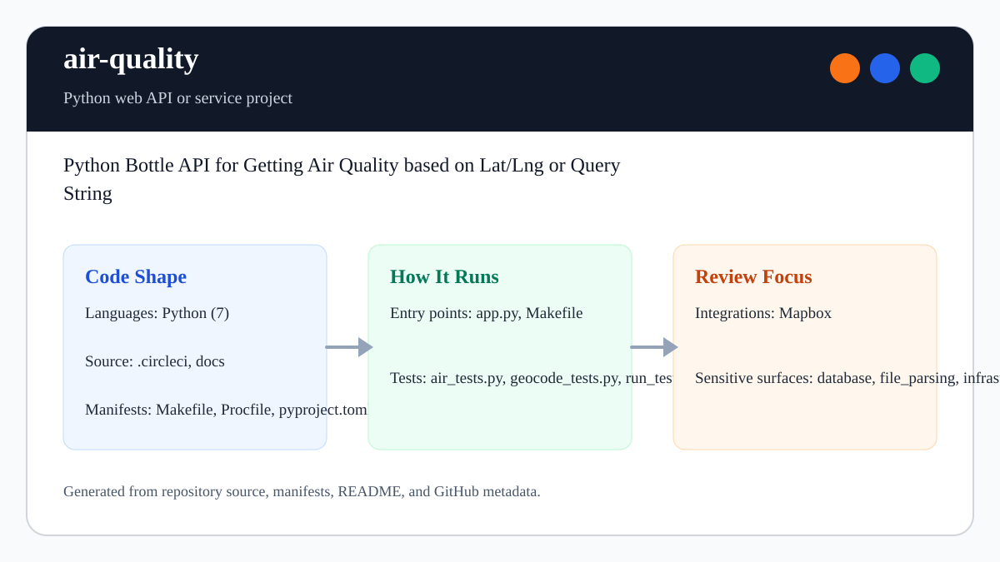

# air-quality

<!-- README-OVERVIEW-IMAGE -->


## Overview

`garethpaul/air-quality` is a Python web API or service project. Python Bottle API for Getting Air Quality based on Lat/Lng or Query String

This README is based on the checked-in source, manifests, scripts, and repository metadata on the `master` branch. The project language mix found during review was: Python (7).

## Repository Contents

- `README.md` - project overview and local usage notes
- `requirements.txt` - Python dependency or packaging metadata
- `.circleci` - source or example code
- `app.py`
- `docs` - source or example code
- `Makefile` - local build or utility targets
- `Procfile`
- `pyproject.toml` - Python dependency or packaging metadata
- `SECURITY.md` - security reporting and disclosure guidance
- `VISION.md` - project direction and maintenance guardrails

Additional scan context:

- Source directories: .circleci, docs
- Dependency and build manifests: Makefile, Procfile, pyproject.toml, requirements.txt
- Entry points or build surfaces: app.py, Makefile
- Test-looking files: air_tests.py, geocode_tests.py, run_tests.py, test_helpers.py

## Getting Started

### Prerequisites

- Git
- Python matching the era of the project

### Setup

```bash
git clone https://github.com/garethpaul/air-quality.git
cd air-quality
python -m pip install -r requirements.txt
```

The setup commands above are derived from repository files. Legacy mobile, Python, or JavaScript samples may require older SDKs or package versions than a modern workstation uses by default.

## Running or Using the Project

- Run `python app.py` after installing Python dependencies.
- Run `make` or inspect `Makefile` for available targets.

## Testing and Verification

- `make check` - run lint, tests, and Python bytecode compilation
- `make lint` - check formatting and static issues with Ruff
- `make test` - run the dependency-free unittest suite
- `make build` - compile tracked Python files

When the required SDK or runtime is unavailable, use static checks and source review first, then verify on a machine that has the matching platform toolchain.

## Configuration and Secrets

- Detected references to Mapbox. Keep API keys, OAuth credentials, tokens, and account-specific values in local configuration only.
- The `/` route requires finite numeric `lat` and `lng` values in valid coordinate ranges. The `/s` route requires a non-empty `query` value.
- The configured `AIRQUALITY_DATA` endpoint must return a JSON object with a `results` list of sensor readings; malformed upstream payloads fail as service errors instead of raw exceptions.
- Mapbox geocoder responses must return a first feature with a two-value
  numeric `center`; malformed geocoder payloads fail with a controlled route
  error.

## Security and Privacy Notes

- Review changes touching network requests, sockets, or service endpoints; examples from the scan include air.py, air_tests.py.
- Review changes touching file, media, JSON, XML, CSV, OCR, or data parsing; examples from the scan include .circleci/config.yml, air.py, air_tests.py, app.py, and 3 more.
- Review changes touching database, model, or persistence code; examples from the scan include CHANGES.md, air.py, docs/plans/2026-06-08-air-quality-engineering-bar.md, geocode.py, and 1 more.
- Review changes touching infrastructure, proxy, cloud, or deployment configuration; examples from the scan include .circleci/config.yml, CHANGES.md, docs/plans/2026-06-08-air-quality-engineering-bar.md.

## Maintenance Notes

- See `SECURITY.md` for vulnerability reporting and safe research guidance.
- See `VISION.md` for project direction and contribution guardrails.
- See `docs/plans/2026-06-09-air-quality-geocode-shape-validation.md` for the
  current geocoder response-shape validation plan.

## Contributing

Keep changes small and tied to the project that is already present in this repository. For code changes, document the toolchain used, avoid committing generated dependency directories or local configuration, and update this README when setup or verification steps change.
